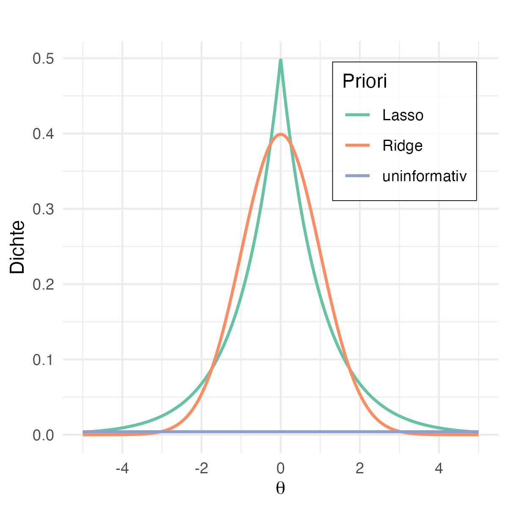
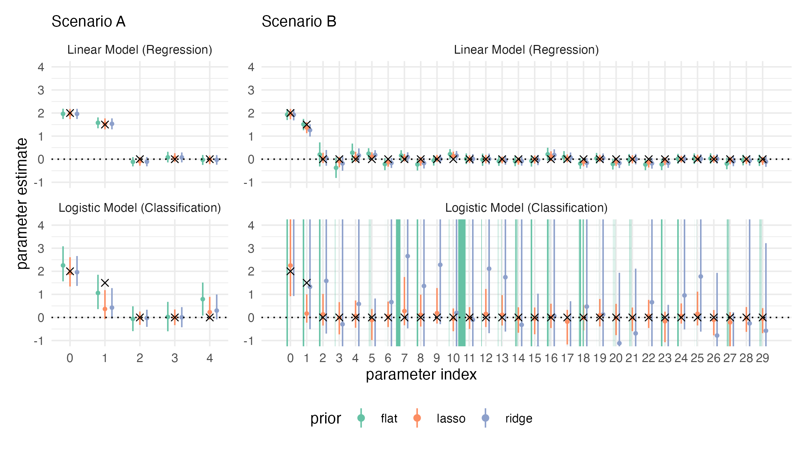

## Motivation für bayesianische Regression

Frequentistisch: ein Modell + Konfidenzintervalle

Bayesianisch: ganze Verteilung von möglichen Modellen


$\to$ Wie können wir Vorwissen (korrekt) modellieren?

$\to$ Wie können wir Unsicherheit im Modell darstellen?

# Bayesianisches **lineares** Modell (LM)

## Frequentistisches $\to$ bayesianisches lineares Modell

Annahmen:

1. i.i.d. Daten $\bD = (\by, \bX)$
2. Kondition auf $\bX$ (implizit)

**Frequentistisches** lineares Modell:  $\by \sim \Ncal(\bX \btheta, \ssd \bI)$

3. Gewichtsparameter $\btheta$ als Zufallsvariable interpretieren

::: {.block}
### **Bayesianisches** lineares Modell:
$$\by \mid \btheta, \ssd \sim \Ncal(\bX \btheta, \ssd \bI)$$
:::

## Prior-Verteilungen für das bayesianische LM

**Prior**-Annahme für $\btheta$ (und evtl. $\ssd$) notwendig $\to$ sehr vielseitige Modell-Anpassung möglich

:::{.block}
### Normal-Invers-Gamma Prior:

$$
\begin{aligned}
  \btheta \mid \ssd &\sim  \Ncal(\mupri, \ssd \Sdpri) \\
  \ssd &\sim \IG(\apri, \bpri) \\
  \btheta, \ssd &\sim \text{NIG}(\mupri, \ssd \Sdpri, \apri, \bpri)
\end{aligned}
$$

mit Prior Parametern: $\mupri, \Sdpri, \apri$ und $\bpri$
:::

**Vorteil**: NIG-Prior ist mit Normalverteilungs-Likelihood konjugiert $\to$ exakte Inferenz möglich (mehr dazu später)

<!-- TODO: Bild -->

## Uninformative Prior als Spezialfall der NIG-Prior

<!-- (TODO: relevant?) -->

:::{.block}
### Uninformative Prior

z.B. mit NIG-Prior mit Prior Parametern

$$
\mupri = \bnull, \quad \Sdipri = \bnull \; \text{i.e.}\; \Sdpri \to \infty, \quad \apri = - \frac{p}{2}, \quad \bpri = 0
$$

$\implies$ flache (und damit uninformative) Prior und maximaler Einfluss der Daten auf die Posterior:

$$
\btheta \mid \ssd \overset{a}{\sim}  \Ncal(\mupri, \ssd \infty) \; \implies \; p(\btheta\mid \ssd) \propto 1
$$
:::

TODO: Bild

## Regularisierung: frequentistisch $\to$ bayesianisch

**Erinnerung**: Regularisierung im *frequentistischen* LM durch Minimierung von 
$$\text{PLS}(\btheta) = (\by - \bX \btheta)^\top (\by - \bX \btheta) + \lambda \ \text{pen}(\btheta)$$
mit Regularisierungs-Parameter $\lambda > 0$.
<br/><br/>

**Bayesianische Regularisierung** durch Wahl der Prior-Verteilung für $\btheta$

<!-- lambda steuert Trade-off zwischen Regularisierung und Modellanpassung

Idee: immer wenn wir regularisieren, treffen wir in unserem Modell implizit die Annahme, dass wir es für unwahrscheinlich halten, dass viele Kovariablen einen Einfluss haben. Das macht beim frequentistischen Modell Chaor (das Modell ist nicht mehr so richtig probabilistisch) aber passt super in die Prior von bayesianischen Modellen -->


## Regularisierung durch Wahl der Prior-Verteilung

:::{.block}
### Ridge Regularisierung

- Frequentistisch [@hoerl_ridge_1970;@hoerl_ridge_1970-1]: $\text{pen}(\btheta) = \|\btheta\|_2^2$

- Bayesianisch [@mackay_bayesian_1992]: $\btheta \sim \Ncal(\bnull, \taus \bI) \; \text{mit} \; \taus \propto \frac{1}{\lambda}$
:::

:::{.block}
### Lasso Regularisierung 

- Frequentistisch [@tibshirani_regression_1996]: $\text{pen}(\btheta) = \|\btheta\|_1$

- Bayesianisch [@park_bayesian_2008]:
$$
\begin{aligned}
\btheta \mid \btaus &\sim \Ncal(\bnull, \btaus \bI) \\
\taus_j &\overset{\text{i.i.d.}}{\sim} \text{Exp}(0.5 \lambda^2), \quad j = 1, \dots, p
\end{aligned}
$$
<!-- Entwickelt aus Laplace-Prior  -->
:::

**Problem**: keine Variablenselektion (im Gegensatz zu frequentistischem Lasso)

$\to$ Alternative Priors für Variablenselektion: Spike and Slab [@mitchell_bayesian_1988], Horseshoe [@carvalho_horseshoe_2010], u.v.m.

<!-- 
bayes Lasso setzt Koeffizienten nicht automatisch auf 0 -> dafür brauch wir speziellere Priors, die hier aber etwas außerhalb unseres Umfangs liegen.
-->

## Visualisierung der Prior-Verteilungen

{height='70%'}

# Bayesianisches **generalisiertes** lineares Modell (GLMs)


## Bayesianisches LM $\to$ **GLM**
<!-- (alt: Generalisierung des bayesianischen linearen Modells) -->

$$
\text{LM:} \; \by \mid \btheta, \ssd \sim \Ncal(\bX \btheta, \ssd \bI) \quad
\to \quad \text{GLM:} \; \by \mid \btheta \sim F(g^{-1}(\bX \btheta))
$$

- Verteilungsannahme von $\by$ wird (äquivalent zum frequentistischen GLM) auf alle Verteilungen $F$ der Exponentatialfamilie ausgeweitet
- Skala des linearen Prädiktors $\bX \btheta$ wird mit der Link-Funktion $g^{-1}$ angepasst


## Bayesianisches GLM $\to$ **logistisches** Modell

:::{.block}
### $\to$ Bayesianisches logistisches Modell

$$
\begin{aligned}
  \by_i \mid \btheta &\sim \text{Bin}(1, g^{-1}(\bx_i \btheta)), \quad i = 1, \dots, n \\
  g^{-1}(\bx_i \btheta) &= \sigma(\bx_i \btheta)
\end{aligned}
$$

Für Beobachtungen $\bx_i = (1, x_{i1}, \dots, x_{ip})^\top$ und Sigmoid-Link $\sigma(y) = \frac{\exp(y)}{1 + \exp(y)}$

:::

**Prior Wahl**

- I.A. äquivalent zum LM möglich, z.B. Normalverteilungs-Prior
- Verteilungen mit schweren Rändern (z.B. t-Verteilung, Cauchy Verteilung) addressieren Separation und fördern Shrinkage [@gelman_weakly_2008;@ghosh_use_2017]
- Für Regularisierung können dieselben Priors wie im LM verwendet werden [@ohara_review_2009;@fahrmeir_bayesian_2010;@van_erp_shrinkage_2019]

# Inferenz im bayesianischen (G)LM

## Inferenz der Parameter Posterior

**Erinnerung**

- Inferenz im frequentistischen LM: z.B. *kleinste Quadrate Schätzung* mit

$$
\hbtheta_{KQ} = (\bX^\top \bX)^{-1} \bX^\top \by \quad \text{mit} \quad \hbtheta_{KQ} \overset{a}{\sim} \Ncal(\btheta, \ssd (\bX^\top \bX)^{-1})
$$

- Inferenz im bayesianischen LM: *Bayes-Regel* zur Ermittlung der Parameter Posterior

$$
p(\btheta \mid \by) = \frac{p(\by \mid \btheta) \; p(\btheta)}{\int p(\by \mid \btheta) \; p(\btheta) d \btheta}
= \frac{\Lcal(\btheta) \; p(\btheta)}{\int \Lcal(\btheta) \; p(\btheta) d \btheta}
$$


<!-- 
 emphasize why inference is harder in the Bayesian case for GLMs

In Bayesian inference, unlike just computing a point estimate, we need the entire posterior. Except in simple conjugate cases, the denominator (normalizing constant) is intractable, so we resort to other techniques. -->

## exakte Inferenz mit konjugierten Priors

:::{.block}
### Inferenz mit konjugierten Priors

Bayesianisches LM: aus der Konjugiertheit von $\by \mid \btheta, \ssd \sim \Ncal$ und $\btheta, \ssd \sim \text{NIG}$ ergibt sich

$$
\btheta, \ssd \mid \by \sim \text{NIG}(\mupo, \Sdpo, \apo, \bpo)
$$
mit
$$
\mupo = \Sdpo (\Sdipri \mupri + \bX^\top \by), \quad \Sdpo = (\bX^\top \bX + \Sdipri)^{-1}
$$
:::

- **uninformative NIG-Prior**: Posterior Mean und KQ-Schätzer sind äquivalent:
$$
\mupri = \bnull, \quad \Sdipri = \bnull \; \implies \; \mupo = (\bX^\top \bX)^{-1} \bX^\top \by,\quad \Sdpo = (\bX^\top \bX)^{-1}
$$

<!-- Bei einer uninformativen prior reduziert sich der posterior mean auf den KQ Schätzer -> sanity check that our Bayesian approach generalizes the classical result. -->
<!-- $\to$ Marginale Posterior Verteilungen von $\btheta$ und $\ssd$ durch Integration für z.B. Kredibilitätsintervalle -->

- **Ridge**: Spezialfall der NIG-Prior $\to$ konjugierte Berechnung der Parameter Posterior
- **Lasso**: Prior hat keine geschlossene Form, aus der Posterior kann aber mit Gibbs-Sampling simuliert werden [@park_bayesian_2008]

## Posterior Update für Prior-Verteilungen

{width='90%'}

<!-- {width='85%'} -->

<!-- $$ -->
<!-- y_i = \theta x_i + \epsilon_i, \quad i = 1, \dots, 10\\ -->
<!-- \quad \theta = 2, \quad\epsilon_i \sim \Ncal(0, 5) -->
<!-- $$ -->

<!-- {width='85%'} -->


## Approximative Inferenz

**Problem**: Inferenz mit konjugierten Priors ist nur sehr selten möglich [@polson_bayesian_2013]

$\to$ **Approximative bayesianische Inferenz**, um aus der Posterior zu ziehen, mit z.B.:

<!-- In the logistic model (and most Bayesian GLMs), we can’t integrate the posterior analytically. We have two broad strategies: (1)  – draw lots of samples from the posterior; (2) Deterministic approximations – approximate the posterior with a simpler distribution. -->

- Sampling Methoden (Markov chain Monte Carlo Methoden)
    - **Metropolis-Hastings Algorithmus** [@hastings_monte_1970]
    - Gibbs Sampling (bedingte Konjugiertheit) [@dellaportas_bayesian_1993]
    - Hamiltonian Monte Carlo (v.a. hochdimensionale Posterior) [@neal_probabilistic_1993]

- Deterministische Approximation, z.B.  **Laplace Approximation** [@tierney_accurate_1986]
- U.v.m.

## Metropolis Hastings Algorithmus [@hastings_monte_1970]

- **Idee**: Aus der Posterior $p(\btheta\mid \by)$ ziehen, ohne Annahmen über ihre exakte Form machen zu müssen
- **Problem**: Ergebnisse sind am Besten, wenn die Posterior bis auf eine Konstante (meist die Normalisierungskonstante $\int p(\by \mid \btheta) \; p(\btheta) d \btheta$) bekannt sind

- **Inputs**:
  - Anzahl der Ziehungen $K \to$ frei wählbar
  - Likelihood $p(\btheta \mid \by)$ und Prior $p(\btheta) \to$ bekannt
  - Proposal Verteilung $q \to$ muss sorgfältig gewählt werden

<!-- Evtl. kürzen: Metropolis-Hastings is an algorithm to draw samples from the posterior when we can’t solve it analytically. We only need to compute the posterior density (up to a constant). It works by proposing random jumps in parameter space and accepting or rejecting them in a way that eventually the samples come from the target posterior. -->

## Metropolis Hastings: Wahl der Proposal Verteilung $q$

<!-- evtl. kürzen (und in Anhang schieben)
One practical note: the efficiency of M-H depends heavily on how you choose the proposal distribution. A common choice is a Gaussian.The main point is that MCMC can be slow and needs tuning.
-->

Effizienz des Algorithmus ist stark abhängig von der Proposal Verteilung.

$\to$ **Optionen**:

- **Normalverteilung**
  $$
  q(\btheta^{(*)} \mid \btheta^{(k)}) \sim \Ncal(\btheta^{(k)} \mid -H^{-1}(\btheta^{(k)}))
  $$
    mit Mittelwert beim letzten Sample. Die Hesse-Matrix $H$ von $p(\btheta \mid \by)$ wird meist mit IWLS geschätzt [@gamerman_markov_1998;@lenk_bayesian_2000;@scott_data_2011] 

- @scott_data_2011 schlägt **Verteilungen mit schweren Rändern** vor $\to$ mehr Mixing, kürzerer Burn-in und schnellere Konvergenz

## Laplace Approximation (LA) [@tierney_accurate_1986]

- **Idee**: Approximation der Posterior mit einer Normalverteilung
  $$
  p(\btheta \mid \by) \approx \Ncal(\hbtheta_{MAP}, H^{-1}(\hbtheta_{MAP}))
  $$
  mit Maximum-a-Posteriori Schätzer $\hbtheta_{MAP}$ und Hesse-Matrix $H$ von $p(\btheta \mid \by)$
- Erweiterung für hierarchische Modelle: Integrated Nested Laplace Appriximation (INLA) [@rue_approximate_2009]


<!-- Intuition: wir fitten eine Normalverteilung um das Maximum der Posterior. Wir finden erst den MAP und benutzen dann die zweite Ableitung (i.e. die Krümmung), um die Normalverteilung anzupassen. Ein bisschen wie bayesianische Taylor-Reihen Erweiterung-->

## *Beispiel:* Vergleich von approximativen Inferenz Methoden

**Setup**: 1.000 synthetische Datensätze mit $n=100$ und 
$$
\begin{aligned}
    &\bX \sim \Ncal(\bnull, \bI), \quad \btheta = (-0.5, 2, 1)\\
    &\text{linear: } \by \mid \btheta \sim \Ncal(\bX \btheta, \bI)\\
    &\text{logistic: } \by \mid \btheta \sim \text{Ber}(\sigma(\bX \btheta))
\end{aligned}
$$


**Experiment**: für jeden Datensatz wurde angepasst:

- Ein lineares und ein logsistisches Regressionsmodell mit $\btheta \sim \Ncal(0, 10 \cdot \bI)$ und $\ssd = 10$
- Mit Laplace Approximation und Metropolis-Hastings ($K$ = 5.000, Burn-in = 500, Thinning Intervall = 10) 

<!-- We generated many synthetic datasets for both a linear regression scenario and a logistic regression scenario, so we know the true parameters. We then fit each using both Laplace approximation and Metropolis-Hastings to compare their accuracy and runtime. -->

## *Beispiel:* LA vs. Metropolis-Hastings

{width='85%'}
{width='97%'}

<!-- - LA war langsamer (kann aber auch an Implementierung liegen!) -->
<!-- - Lineare Regression: ganz gute Schätzungen, Varianz bei LA viel höher -->
<!-- - Logistische Regression: LA liefert bessere Schätzung und kleinere Varianz, dauert aber länger -->
<!-- - generell eher zur Veranschaulichung, ich würde empfehlen modernere Methoden zu benutzen, die sind eigentlich überall implementiert

“Why do you think Laplace gave tighter estimates than MCMC in logistic?” (Perhaps because the posterior was well-behaved and the quadratic approximation was very good, while MCMC had simulation error – mention needing more iterations or that your MCMC might not have fully converged
-->

## Vorhersagen mit bayesianischen Modellen

<!-- - In Machine Learning interessieren wir uns oft eher für Vorhersagen -->

Aus der Bayes Regel:
$$p(\by) = \int p(\by, \btheta) d\btheta = \int p(\by \mid \btheta) p(\btheta) d\btheta$$

:::{.block} 
### Posterior Predictive Distribution

$\to$ Vorhersagen für neue Daten $\tX$ im bayesianischen GLM: [@box_sampling_1980;@barbieri_posterior_2015]

$$
p(\ty \mid \by) = \int p(\ty, \btheta \mid \by) d \btheta 
    = \int p(\ty \mid \btheta, \by) p(\btheta) d \btheta
    \overset{\ty \perp \by \mid \btheta}{=}  \int p(\ty \mid \btheta) p(\btheta) d \btheta
$$

<!-- -> = marginale Verteilung von neuen y bedingt auf die alten Daten (reminder: implizite Bedingung auf Daten X) -->
<!-- -> ist quasi der Mittelwert der bedingten Verteilung von neuen y (also der Likelihood) über die Parameter Posterior -->
:::

Für das bayesianische **logistische Modell** berechnet man $$p(\ty = 1 \mid \by)$$ mit $y_i \in \{0 \text{ (negativ)}, 1 \text{ (positiv)}\}$

<!-- TODO: Bild -->


## Berechnung der Posterior Predictive Distribution

**Analytische Berechnung**: z.B. für die NIG-Prior ergibt sich
  $$\ty \mid \btheta, \ssd, \by \sim \Tcal(2 \apo, \tX \btheta, \frac{\bpo}{\apo} (\bI + \tX \Sdpo \tX^\top))$$

**Approximation**

- für Metropolis-Hastings: $p(\ty = 1 \mid \by) \approx \frac{1}{K} \sum_{k=1}^{K} \sigma(\tX \btheta^{(k)})$
- für Laplace Approximation:
    - Samples $\btheta^{(s)} \sim \Ncal(\hbtheta_{MAP}, H^{-1}(\hbtheta_{MAP}))$ mit $s = 1, \dots, S$ aus der LA-approximierten Parameter Posterior ziehen und wie bei Metropolis-Hastings vorgehen oder
    - LA-approximierte PPD analytisch berechnen:
    
      $$p(\ty = 1 \mid \by) = \int \sigma(\tX \btheta) \; \Ncal_{\btheta}(\hbtheta_{MAP}, H^{-1} (\hbtheta_{MAP})) \; d \btheta$$
    

<!-- wir haben schon gesamplet und können die samples aus der Parameter Posterior jetzt einfach wiederverwenden, um die posterior predictive distribution zu approximieren -->

---

:::{.block}
### Fazit


- Anwendungsmöglichkeiten: kleine Stichproben, explizite Nutzung von Vorwissen, einfache Regularisierung + Erhalt der Interpretierbarkeit

<!-- If we only have a little data, a classic model might wildly overfit or be very uncertain. A Bayesian model says: let’s lean on prior knowledge to stabilize things. Intuitively, it’s like having an expert whispering a suggestion (the prior) when the data is unsure.
We saw Bayesian and frequentist approaches can give similar point estimates (with flat prior) but very different uncertainty quantification – which do you trust more?
“What if the prior is wrong – does it hurt performance?” (You can reply that a very wrong prior can bias results, but ideally one uses either weakly informative priors or does sensitivity analysis; in your experiments you likely used generic priors to see their effect)
In your experience with GLMs, do you think having a prior would be useful? Can you think of scenarios where you’d want to use a Bayesian GLM?”
One critique could be: do we really gain that much over just doing a frequentist analysis? What do you all think?
-->

:::

:::{.block}
### Literatur Empfehlungen

- Bayesianische Regression (v.a. für praktische Anwendung): @gelman_bayesian_2013
- Prior Verteilungen (v.a. Shrinkage): @van_erp_shrinkage_2019 und @celeux_regularization_2012
- Software: z.B. `brms` in `R`, `PyMC` in `python`
:::

# Referenzen

<div id="refs"></div>

# (APPENDIX) Appendix {-}

## Praktische Anwendbarkeit von (bayesianischer) Regularisierung

Vorteile von bayesianischer Regularisierung sind u.a.:

- Probabilistisches Modell trotz Regularisierung
- Regularisierung-Parameter muss nicht als Hyperparameter optimiert werden (z.B. durch Prior auf $\taus$)
- Mehr Anpassungsmöglichkeiten durch Prior-Spezifikation

## Frequentistische vs. bayesianische Lasso Regularisierung

{height='75%'}


## *Beispiel:* Vergleich von Regularisierungs-Priors in linearer und logistischer Regression

**Setup**: zwei synthetische Datensätze mit $n=150$

- **Szenario A**: Sparses Setting ohne Kollinearität oder Überparametrisierung
    - $n = 150,\; n_{train} = 100,\;n_{test} = 50$
    - $\btheta = (2, 1.5, 0, 0, 0)$
    - $\bX \sim \Ncal(\bnull, \bI)$
    - linear: $\by \mid \btheta \sim \Ncal(\bX \btheta,\bI)$, logistisch: $\by \mid \btheta \sim \text{Ber}(\sigma(\bX \btheta))$

- **Szenario B**: uninformatives Setting mit $n \approx p$ und Kollinearität zwischen informativen und uniformativen Koeffizienten
    - $n = 150,\; n_{train} = 30,\;n_{test} = 120$
    - $\btheta = (2, 1.5, 0, \overset{26\; \text{times}}{\dots}, 0)$
    - $\bX \sim \Ncal(\bnull, \Sd), \quad \Sd = \begin{pmatrix} 1 &        &         &        &        \\ & \!\!S_3\!\! &        & 0      &        \\ &        & I_{26} &        &        \\ & 0      &        &        &        \\ \end{pmatrix}, \qquad S_3 = \begin{pmatrix} 1   & 0.8 & 0.8\\ 0.8 & 1   & 0.8\\ 0.8 & 0.8 & 1 \end{pmatrix}$
    - linear: $\by \mid \btheta \sim \Ncal(\bX \btheta, \bI)$, logistisch: $\by \mid \btheta \sim \text{Ber}(\sigma(\bX \btheta))$

---

**Experiment**: Für jeden Datensatz wurde angepasst:

- bayesianisches lineares und logistisches Modell (MCMC mit $K=20000$, Burn-in = 1000, Thinning = 10) mit
- uninformative, Ridge und Lasso Priori

## Ergebnis: Regularisierung in bayesianischen Modellen (I)

**Evaluation**

- Anzahl korrekt als einflussreich identifizierter Kovariablen (Hits)
- Anzahl fälschlich als einflussreich identifizierter Kovariablen (FP)
- Mean log posterior predictive density (MLPPD) [@gelman_understanding_2013]

**Ergebnis**

```{=latex}
\begin{table}[ht]
  \small
  \centering
  \begin{tabular}{@{} ll  rrr   rrr @{}}
    \toprule
    Model & Prior 
      & \multicolumn{3}{c}{Scenario A} 
      & \multicolumn{3}{c}{Scenario B} \\
    \cmidrule(lr){3-5} \cmidrule(lr){6-8}
          &      
      & Hits (of 2) & FP (of 3)  & MLPPD      
      & Hits (of 2) & FP (of 28) & MLPPD     \\
    \midrule
    Linear & flat   & 2 &  0 & -1.425 & 2 &  1 &   -1.605     \\
    Linear & LASSO  & 2 &  0 & -1.424 & 2 &  0 &   -1.464     \\
    Linear & ridge  & 2 &  0 & -1.427 & 2 &  0 &   -1.575     \\
    \specialrule{1.5pt}{0pt}{0pt}
    Logit  & flat   & 2 &  1 & -0.390 & 0 & 21 &   $-\infty$  \\
    Logit  & LASSO  & 1 &  0 & -0.463 & 1 &  0 &   -0.485     \\
    Logit  & ridge  & 1 &  0 & -0.455 & 1 &  0 &   -0.493     \\
    \bottomrule
  \end{tabular}
\end{table}
```


## Ergebnis: Regularisierung in bayesianischen Modellen (II)

{height='80%'}

## Posterior Inference: Verteilung von $\btheta$

- Im frequentistischen Modell: $$\hbtheta_{KQ} \overset{a}{\sim} \Ncal(\btheta, \ssd (\bX^\top \bX)^{-1})$$

- Im bayesianischen Modell (NIG-Prior): $$
\btheta \sim \Tcal(2 \apo, \mupo, \bpo / \apo \Sdpo) \approx \Ncal(\mupo, \bpo / \apo \Sdpo)$$
für großes $p$

## Posterior Inference: Der Metropolis (-Hastings) Algorithmus

1. $\btheta^{(1)}$ inizialisieren
2. Für $k = 1, \dots, K$
    1. $\btheta^{(*)}$ aus der \textit{Proposal Verteilung} $q(\btheta^{(*)} \mid \btheta^{(k)})$ ziehen
    2. \textit{Akzeptanzwahrscheinlichkeit} berechnen
    
        $$
            \alpha = \min \Bigl(
                1, \frac{
                    p(\btheta^{(*)} \mid \by)\; p(\btheta^{(*)}) \; q(\btheta^{(k)} \mid \btheta^{(*)})}{
                        p(\btheta^{(k)} \mid \by)\; p(\btheta^{(k)}) \; q(\btheta^{(*)} \mid \btheta^{(k)})
                    }
                \Bigr)
        $$
    3. Vorschlag $\btheta^{(*)}$ akzeptieren oder verwerfen (für $u \sim \text{Uni}[0, 1]$)
    
        $$
        \begin{cases}
                u \le \alpha & \btheta^{(k+1)} = \btheta^{(*)}\\
                u > \alpha & \btheta^{(k+1)} = \btheta^{(k)}\\
        \end{cases}
        $$

Und z.B. 
$$
q(\btheta^{(*)} \mid \btheta^{(k)}) \sim \Ncal(\btheta^{(k)} \mid -H^{-1}(\btheta^{(k)}))
$$
mit $H(\btheta) = \nabla_{\btheta}^2  \log \Bigl(p(\btheta^{(k)} \mid \by)\; p(\btheta^{(k)})\Bigr)$


## Posterior Inference: Mittelwert und Varianz für Laplace Approximation

Exemplarische Berechnung für ein bayesianisches logistisches Modell mit der Prior $\btheta \sim \Ncal(\bnull, \ssd \bI)$: 

Es gilt dass mit Laplace Approximation $p(\btheta \mid \by) \approx \Ncal(\hbtheta_{MAP}, H^{-1}(\hbtheta_{MAP}))$ mit

$$
\begin{aligned}
    \hbtheta_{MAP} &= \arg \max_{\btheta} p(\btheta \mid \by)
        \overset{\text{Bayes' rule}}{=} \arg \max_{\btheta} p(\by \mid \btheta) p(\btheta) \; d\btheta  \\
        &= \arg \max_{\btheta} \sumin \log \Bigl( \sigma(y_i \; \bx_i\btheta)\Bigr) - \frac{1}{2 \ssd} \btheta^\top \btheta \\
    H(\btheta) &= - \nabla^2_{\btheta}  \log p (\btheta \mid \by) = \frac{1}{\ssd} \bI + \sumin
    \sigma(y_i \; \bx_i\btheta) \Bigl(1 - \sigma(y_i \; \bx_i\btheta)\Bigr)
        \bx_i \bx_i^\top.
\end{aligned}
$$

